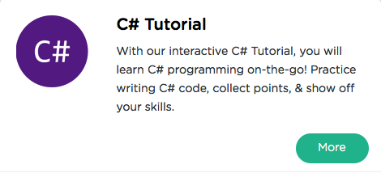

```
Roberto Nogueira  
BSd EE, MSd CE
Solution Integrator Experienced - Certified by Ericsson
```
# Sololearn C#



**About This Tutorial**

This is to grasp rapidly the language and its concepts.

[Sololearn C#](https://www.sololearn.com/Play/CSharp)

#### Topics
```
R Tutorial
[~] Basic Concepts
[ ] Conditional and Loops
[ ] Methods
[ ] Classes & Objects
[ ] Arrays & Strings
[ ] More on Classses
[ ] Inheritance & Polymorphism
[ ] Struct, Enums, Exceptions & Files
[ ] Generics
[ ] Certificate
```

